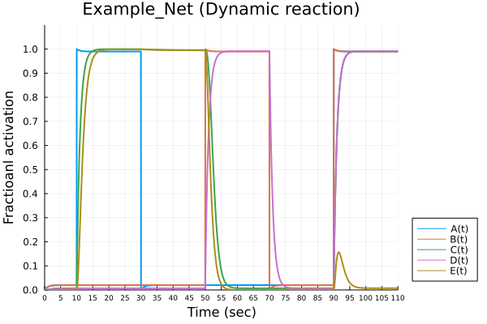

# MMSB2022_Final
110.2 BEBI5009_生物系統模擬

# Reference

1. Kraeutler, M. J., Soltis, A. R., & Saucerman, J. J. (2010). Modeling cardiac β-adrenergic signaling with normalized-Hill differential equations: comparison with a biochemical model. _BMC Systems Biology, 4_, 157. https://doi.org/10.1186/1752-0509-4-157

2. [Netflux](https://github.com/saucermanlab/Netflux)（Matlab code）

# ODE solver

[mmsb-bebi-5009](https://ntumitolab.github.io/mmsb-bebi-5009/mmsb/ch03.html)

[Numerical Error](https://diffeq.sciml.ai/stable/basics/faq/#What-does-tolerance-mean-and-how-much-error-should-I-expect)

[Tutorial：Ordinary Differential Equations](https://diffeq.sciml.ai/dev/tutorials/ode_example/#Defining-Parameterized-Functions)

[Julia：如何调试微分方程求解问题](https://blog.csdn.net/weixin_39679367/article/details/120641325?ops_request_misc=&request_id=&biz_id=102&utm_term=julia%20callback&utm_medium=distribute.pc_search_result.none-task-blog-2~all~sobaiduweb~default-0-120641325.142^v14^control,157^v14^control&spm=1018.2226.3001.4187)

# Figure

